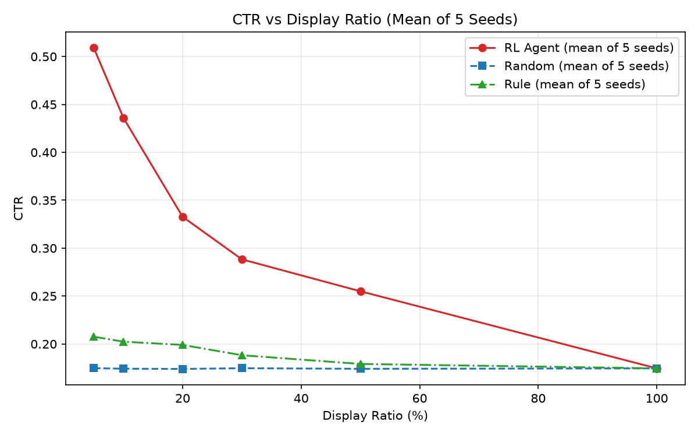
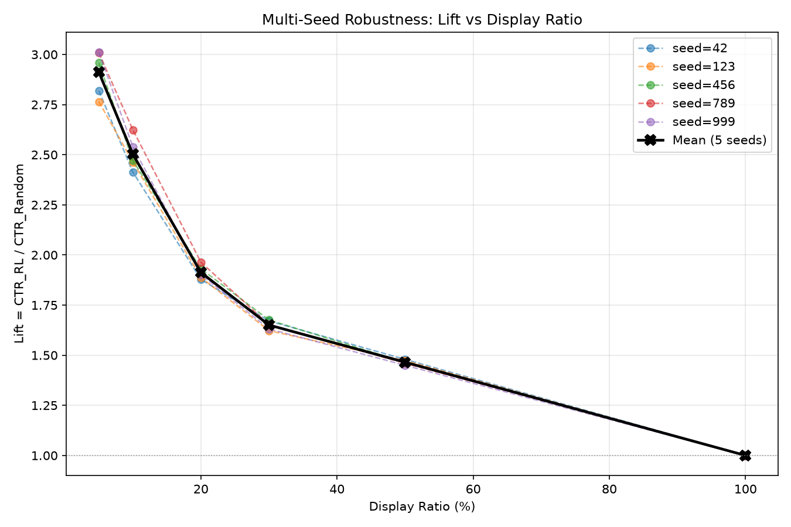
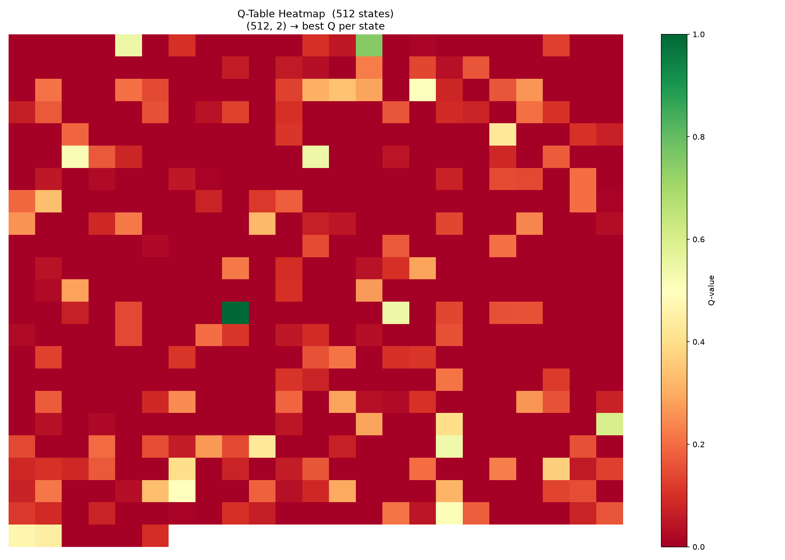
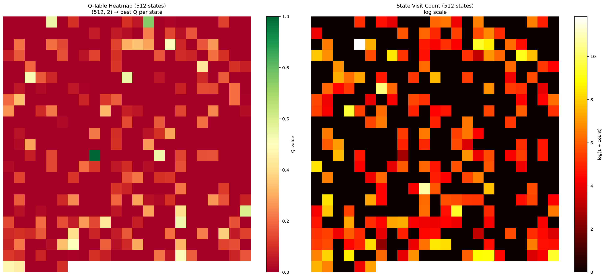

# Ad CTR Prediction with Tabular Q-Learning

*A Contextual Bandit Approach to Budget-Constrained Impression Selection*

A contextual multi-armed bandit project for selecting high-value mobile ad impressions on the Avazu dataset, implemented with tabular Q-learning and evaluated under fixed display-budget quotas. Developed as a self-proposed topic for the Machine Learning course.

## Important Notice

This project is developed for ACADEMIC PURPOSES ONLY. It is NOT production-ready and should NOT be used in real-world advertising systems. No warranty is provided.

> **Disclaimer & Data Usage**
> The Avazu dataset is a classic public dataset widely used for CTR research and contains no real-world personal privacy or commercial secrets. The code and analytical frameworks in this repository are strictly for educational and technical exchange purposes. Commercial use is strictly prohibited.

## Table of Contents

- [Project Overview](#project-overview)
- [Method](#method)
- [Dataset](#dataset)
- [Project Structure](#project-structure)
- [Quick Start](#quick-start)
- [Baselines & Evaluation](#baselines--evaluation)
- [Key Results](#key-results)
- [Q-Table Diagnostics](#q-table-diagnostics)
- [Method Selection & Reflection](#method-selection--reflection)
- [Tech Stack](#tech-stack)
- [License](#license)

## Project Overview

In digital advertising, click-through rate (CTR) estimation directly drives platform revenue and user experience. Supervised models such as logistic regression and DeepFM predict a click probability for every impression, but when a platform can only serve a fraction of incoming traffic — finite slots, a finite budget — the operational problem is a **selection** problem: given the context of each impression, decide whether to display it so that the CTR of the served impressions is maximized.

This project models that decision as a **contextual multi-armed bandit — the single-step special case of reinforcement learning without state transitions**. At each impression the agent observes a hashed context, chooses *display* or *skip*, and receives an immediate reward (1 for a click, 0 otherwise). The Avazu sample is offline, i.i.d. and confined to a single hour, so no decision feeds back into the environment and no Markov chain can be modeled; the discount factor is γ = 0. Under this setting the tabular Q-learning update degenerates to an incremental, per-context mean-reward estimator — mathematically equivalent to conditional-mean estimation in supervised learning.

The value of the exercise therefore lies not in sequential optimization but in a **disciplined bandit pipeline**: leakage-safe state construction (deterministic MD5 hashing; long-tail truncation fitted on the training set only), Laplace-smoothed value estimates for sparse contexts, and a Top-k display policy evaluated at quotas from 5% to 100% against random and rule-based baselines across five random seeds. Here the "budget" is an evaluation-time display quota rather than a dynamically consumed resource; the code keeps interfaces reserved for upgrading to a full MDP once data with bidding dynamics becomes available.

## Method

### Contextual Multi-Armed Bandit Formulation

Since all records in the selected data snapshot fall within the same hour and each impression is independent, the problem is modeled as a contextual multi-armed bandit rather than a full MDP:

| Element | Design |
| --- | --- |
| **State** | 512 buckets obtained by MD5-hashing four contextual features |
| **Action** | Display (1) / Do not display (0) |
| **Reward** | Sparse reward: +1 for click, 0 otherwise |
| **Discount factor** | gamma = 0 (single-step decisions; see [Method Selection & Reflection](#method-selection--reflection)) |

### State Construction

The state string is built from four features and mapped deterministically to one of 512 buckets:

    state_str = f"{hour_bucket}|{banner_pos}|{site_id_group}|{app_category_group}"
    state_id  = int(md5(state_str).hexdigest(), 16) % 512

- `hour_bucket`** — last two digits of the **`hour` field (`YYMMDDHH`)
- `banner_pos` — ad banner position, used as-is
- `site_id_group`** / **`app_category_group` — long-tail truncation: categories appearing fewer than 10 times in the **training set** are merged into `'Other'`; unseen categories in the test set are also mapped to `'Other'`

MD5 hashing is used instead of Python's built-in `hash()`, whose salt randomization would break reproducibility.

### Tabular Q-Learning with Two Convergence Enhancements

The agent keeps a `(512, 2)` Q-table together with per-bucket visit, click and impression counters.

1. **Visit-count-decayed learning rate:** every logged impression unconditionally updates `Q(s, 1)` with `alpha = 1 / count(s)` — fast learning in early training, exact mean convergence later. No epsilon-greedy exploration is used: in an offline bandit the "do not display" action never receives a real reward, so exploring it would only waste samples.
2. **Laplace-smoothed scoring:** at evaluation time each bucket is scored as

       score(s) = (click_sum(s) + 10 * global_ctr) / (impression_sum(s) + 10)

   The prior mean is anchored to the global CTR (\~0.175), so never-visited buckets inherit a neutral global-CTR estimate instead of a biased zero.

Training runs for 5 epochs over the shuffled training set. Tabular Q-learning was deliberately chosen over deep variants: with only 512 states, a deep network would be overkill.

### Leakage Prevention

Every statistic used at evaluation time is fitted on the training set only:

| Check | Leakage? | Note |
| --- | --- | --- |
| Train/test split | No | split first (seed = 42), then fit anything |
| Long-tail truncation | No | frequency tables computed on the training set only |
| Hash buckets | No | MD5 is a pure mathematical transform |
| Rule baseline CTR | No | `banner_pos` historical CTR computed on the training set only |
| Global CTR prior | No | training 0.1749 differs from test 0.1728 |
| Q-learning updates | No | iterate over training samples only |

## Dataset

Experiments use the [avazu\_ctr\_train](https://www.kaggle.com/datasets/wuyingwen06/avazu-ctr-train/data) (Kaggle), which contains roughly 40 million real mobile ad impression records. To stay within a CPU-only, sub-10-minute budget, only the **first 100,000 rows** are read:

| Item | Value |
| --- | --- |
| Source file | `train.csv` (Avazu, 24 columns) |
| Rows used | 100,000 |
| Split | random 80% / 20% (`seed = 42`) |
| Train / test size | 80,000 / 20,000 |
| Global CTR (train) | \~0.1749 |
| Time span of sample | a single hour (`14102100`), hence random rather than temporal split |
| Key challenge | high-cardinality, sparse categorical features; severe class imbalance |

> **The dataset file is NOT included in this repository.** `train.csv` is about 6.3 GB and is excluded via `.gitignore`. Download  from the [avazu\_ctr\_train](https://www.kaggle.com/datasets/wuyingwen06/avazu-ctr-train/data), decompress it, and place the resulting `train.csv` at the project root. The code reads only the first 100,000 rows, so the full pipeline still finishes in a few seconds on a plain CPU laptop.

## Project Structure

    04_rl_ctr_avazu/
    ├── env.py                  # Data loading, 80/20 split, feature engineering, MD5 hashing
    ├── agent.py                # Tabular Q-learning agent (incremental CTR mean estimator)
    ├── train.py                # Training-only pipeline; saves model.npz
    ├── evaluate.py             # 3-policy x 6-display-ratio evaluation + CTR curve plotting
    ├── run.py                  # One-click entry: single-seed run and --multi-seed robustness mode
    ├── check_data.py           # Standalone EDA / data sanity-check script
    ├── plot_heatmap.py         # Q-table heatmap (reads model_seed42.npz)
    ├── plot_comparison.py      # Side-by-side Q-value vs visit-count heatmaps
    ├── requirements.txt        # Pinned dependencies
    ├── model.npz               # Saved Q-table from train.py
    ├── model_seed{42,123,456,789,999}.npz  # Per-seed checkpoints from run.py
    ├── multi_seed_results.csv  # Raw CTR/Lift numbers for all 5 seeds x 6 ratios
    ├── ctr_vs_ratio.png        # CTR vs display ratio curve
    ├── multi_seed_lift.png     # Lift curves across 5 seeds
    ├── q_heatmap_seed42.png    # Q-table heatmap (seed = 42)
    ├── q_vs_count_comparison.png  # Q-value vs visit-count diagnostic heatmaps
    ├── LICENSE
    └── README.md

`train.csv` must be added manually (see [avazu\_ctr\_train](https://www.kaggle.com/datasets/wuyingwen06/avazu-ctr-train/data)). Trained checkpoints (`*.npz`) are tracked on purpose: they are only \~21 KB each and let the plotting scripts run without retraining.

## Quick Start

    # 1. (Optional) create a virtual environment — developed on Python 3.12.1
    python -m venv .venv
    # Windows
    .venv\Scripts\activate
    # macOS / Linux
    source .venv/bin/activate
    
    # 2. Install dependencies
    pip install -r requirements.txt
    
    # 3. Prepare the dataset: put train.csv at the project root (see Dataset above)
    
    # 4. Run the full pipeline (seed = 42): load -> train -> evaluate -> plot
    python run.py
    
    # Robustness verification over 5 seeds (42/123/456/789/999)
    python run.py --multi-seed

Other entry points:

    python train.py            # Train only, saves the Q-table to model.npz
    python plot_heatmap.py     # Render q_heatmap_seed42.png from model_seed42.npz
    python plot_comparison.py  # Render q_vs_count_comparison.png from model_seed42.npz
    python check_data.py       # Optional EDA / sanity checks on train.csv

**Expected runtime:** about 1 second for a single run and about 4 seconds for the five-seed run (excluding one-time data parsing), on a plain CPU laptop with no GPU. At the 100% display ratio the program asserts that all three policies converge to the test set's global CTR; any mismatch triggers a warning.

## Baselines & Evaluation

**Policies**

- **RL Agent:** rank test samples by the Laplace-smoothed score of their hash bucket, display the top k%.
- **Random:** sample k% of the test set uniformly at random (seed = 42, averaged over 10 draws to reduce variance).
- **Rule:** rank by the historical CTR of `banner_pos` computed on the training set, display high-CTR slots first.

All three policies select the **same number of samples** at every display ratio, so the CTR comparison is fair by construction.

**Metrics**

- CTR under display ratios of 5% / 10% / 20% / 30% / 50% / 100%
- **Lift** = CTR*RL / CTR*Random, the improvement multiple of the RL strategy over random display

## Key Results

### Main Experiment (seed = 42)

| Display Ratio | RL CTR | Random CTR | Rule CTR | Lift |
| --- | --- | --- | --- | --- |
| 5% | 49.00% | 17.38% | 21.80% | 2.82 |
| 10% | 41.75% | 17.30% | 20.05% | 2.41 |
| 20% | 32.70% | 17.41% | 20.18% | 1.88 |
| 30% | 28.93% | 17.32% | 18.92% | 1.67 |
| 50% | 25.36% | 17.14% | 18.10% | 1.48 |
| 100% | 17.28% | 17.28% | 17.28% | 1.00 |

### Robustness Verification (5 random seeds)

To rule out chance, the full pipeline was repeated with seeds 42 / 123 / 456 / 789 / 999. Raw numbers are in [multi\_seed\_results.csv](multi_seed_results.csv).

**RL CTR across seeds**

| Seed | @5% | @10% | @20% | @30% | @50% | @100% |
| --- | --- | --- | --- | --- | --- | --- |
| 42 | 0.4900 | 0.4175 | 0.3270 | 0.2893 | 0.2536 | 0.1728 |
| 123 | 0.4780 | 0.4180 | 0.3250 | 0.2818 | 0.2550 | 0.1727 |
| 456 | 0.5000 | 0.4215 | 0.3280 | 0.2832 | 0.2499 | 0.1708 |
| 789 | 0.5440 | 0.4670 | 0.3468 | 0.2950 | 0.2600 | 0.1784 |
| 999 | 0.5340 | 0.4565 | 0.3367 | 0.2922 | 0.2564 | 0.1779 |
| **Mean** | **0.5092** | **0.4361** | **0.3327** | **0.2883** | **0.2550** | **0.1745** |
| **Std** | 0.0255 | 0.0212 | 0.0081 | 0.0051 | 0.0033 | 0.0031 |

**Lift across seeds**

| Seed | @5% | @10% | @20% | @30% | @50% | @100% |
| --- | --- | --- | --- | --- | --- | --- |
| 42 | 2.82 | 2.41 | 1.88 | 1.67 | 1.48 | 1.00 |
| 123 | 2.76 | 2.46 | 1.89 | 1.62 | 1.47 | 1.00 |
| 456 | 2.96 | 2.47 | 1.93 | 1.68 | 1.46 | 1.00 |
| 789 | 3.01 | 2.62 | 1.96 | 1.65 | 1.46 | 1.00 |
| 999 | 3.01 | 2.54 | 1.90 | 1.63 | 1.45 | 1.00 |
| **Mean** | **2.91** | **2.50** | **1.91** | **1.65** | **1.46** | **1.00** |
| **Std** | 0.1018 | 0.0729 | 0.0312 | 0.0211 | 0.0103 | 0.0000 |

- At the 5% display ratio, mean Lift reaches **2.91 ± 0.10**, with mean RL CTR of **50.92% ± 2.55%**.
- Lift decreases monotonically for every seed and converges exactly to 1.00 at 100%, validating the evaluation framework.
- Even for the worst-performing seed, the RL strategy beats Random by 2.76x.

### Key Findings

1. **Precise selection under extreme scarcity.** With only 5% of the display budget, the agent achieves a 49% CTR — nearly 3x the random strategy — demonstrating accurate identification of high-value impressions.
2. **Explainable monotonic decay.** As the display ratio grows, the agent is forced to include lower-value samples to satisfy the quota, so Lift decreases monotonically and must return to 1.00 at 100%, where no selection freedom remains.
3. **Why the agent can learn.** The data contains genuinely learnable signal (stable CTR differences across hash buckets), and the 512-bucket state space keeps every bucket sufficiently sampled for reliable value estimation.

## Q-Table Diagnostics

To inspect whether high Q-values come from adequately explored states rather than noise, the Q-table and per-bucket visit counts are visualized as heatmaps (seed = 42).

The diagnostic flags buckets with high Q-values but fewer than 5 visits — candidate overfitting spots that Laplace smoothing and the 512-bucket cap are designed to keep in check.

## Method Selection & Reflection

I document limitations explicitly rather than hiding them, because knowing where a method fails is as important as knowing how to apply it.

**Method must match data.** The Avazu snapshot is offline, i.i.d. and confined to one hour: independent impressions, anonymous users, and no bidding dynamics — it cannot support Markov-chain modeling, and for plain CTR prediction supervised learning (e.g. logistic regression or FM) would be the more natural formulation. With γ = 0 and no state transitions, the Q-learning update is exactly a per-context historical-mean estimator, so the reinforcement-learning route and supervised frequency estimation reach the same destination by different paths.

**The real takeaway.** Method selection must be driven by data structure: before choosing an algorithm, first ask whether the method and the data match. This lesson is worth more to me than the 2.91x Lift itself.

**When this approach would fail.** (1) No learnable signal — CTR differences across contexts vanish; (2) a state space too large for the Q-table to converge; (3) unreliable estimates in small-sample buckets causing overfitting; (4) severe train/test distribution shift.

**Future extension.** With a dataset containing real-time bidding dynamics, the framework can be upgraded into a full MDP (γ \> 0, state transitions, a budget that is actually consumed over time); DQN can replace the tabular Q-table for larger state spaces, online learning can handle distribution shift, and policy-gradient methods can support continuous actions such as bid prices.

## Tech Stack

- **Python 3.12.1** (developed on Windows 10; no GPU required)
- **NumPy 2.5.2** — Q-table, sampling and evaluation
- **pandas 3.0.5** — data loading and feature engineering
- **Matplotlib 3.11.1** — result and diagnostic visualization

## License

This project is licensed under the MIT License — see the [LICENSE](LICENSE) file for details.

